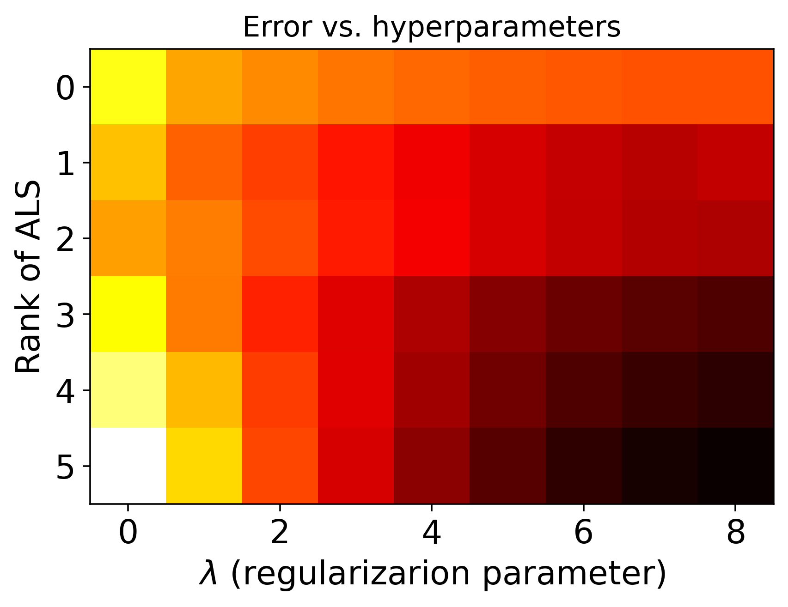
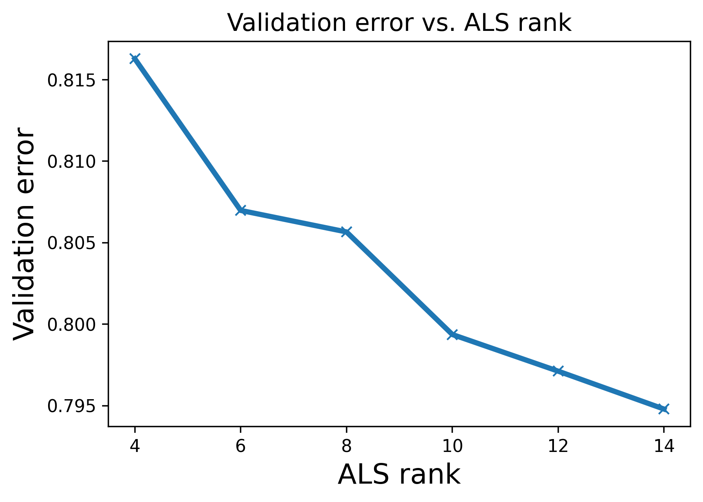
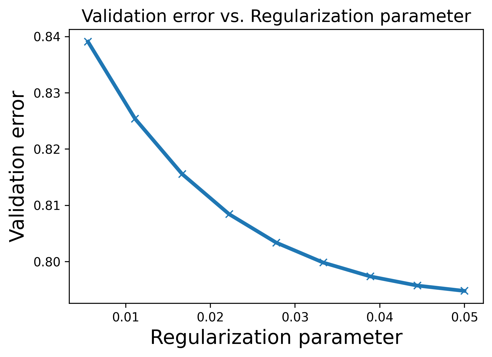

# MovieRecommendationSystem

Movie Recommendation System uses Alternating Least Squares (ALS) Machine Learning classifier to provide movie recommendations to a user depending on the user's ratings of other movies, and also depending on all the ratings of other users. 

* Model is trained on a large 25 million rating dataset, (MovieLens)[https://grouplens.org/datasets/movielens/25m/, "MovieLens"].
* Apache Spark and HDFS are used to handle the large size of data
* Google Dataproc is used to run Apache Spark and Hadoop on the cloud

## Hyperparameter tuning and iteration convergence

* ALS objective-function minimization is truncated at a finite number of iterations. We sweep this iteration number to test for convergence.

* We next perform hyperparameter tuning, to find the optimal values of the regularization parameter (lambda), and the rank of ALS factors (k).
  

 It can be seen that the least validation error is found at lambda = 0.05 and rank = 14.

* Further, for regularization parameter lambda = 0.05, the variation of validation error vs. rank is seen to be monotonously decreasing.

* For rank = 14, the variation of validation error vs. regularization parameter is seen to be as follows.

  
